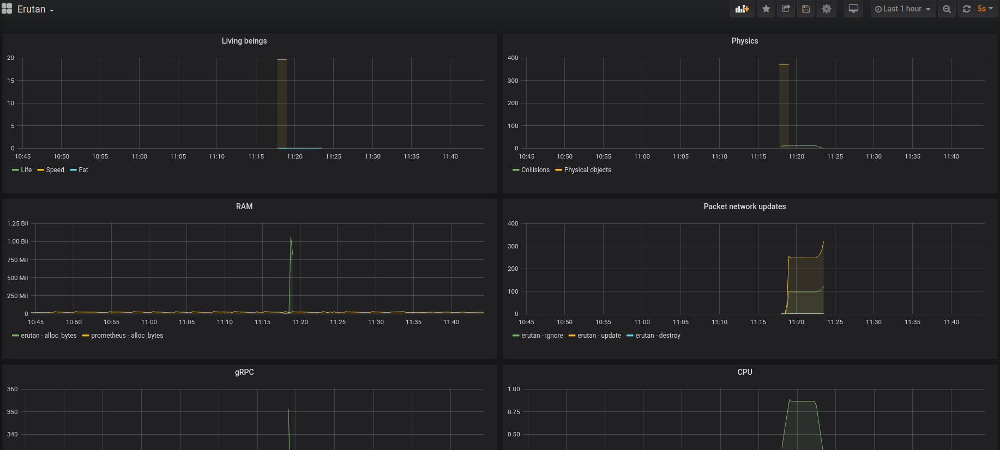

# Erutan-go

[](https://goreportcard.com/report/github.com/The-Tensox/erutan-go)
[](http://godoc.org/github.com/The-Tensox/erutan-go)
[](https://github.com/The-Tensox/erutan-go/releases/latest)

WIP - huge refactors to be expected, some ugly code at some places :).

Trying to simulate evolution, synchronized over gRPC to clients that render a 3D visualisation.

To be used with [the Unity client](https://github.com/The-Tensox/Erutan-unity)

## Usage

### SSL/TLS configuration

```bash
# Edit your /etc/ssl/openssl.cnf add subjectAltName = IP:127.0.0.1 in [v3_ca] section

```bash
# Maybe it will do the trick but not tested :D
sed -i -e 's/#subjectAltName = IP:127.0.0.1/subjectAltName = IP:127.0.0.1/g' /etc/ssl/openssl.cnf
```

```bash
openssl genrsa -out server1.key 2048 &&
openssl req -new -x509 -sha256 -key server1.key -out server1.crt -days 3650
cp server1.crt $UNITY_PROJECT_PATH/Assets/StreamingAssets
```

### Run

```bash
go get github.com/The-Tensox/Erutan-go
cd $GOPATH/src/github.com/The-Tensox/Erutan-go
make run
```

### With Docker

```bash
make dbuild
make drun
```

You can tweak the [base configuration](config.yml.

## Tests

```bash
go test -v
```

## Monitoring

Some metrics are exposed.



Install and run [Grafana](https://grafana.com) + [Prometheus](https://prometheus.io/docs/introduction/overview) to monitor erutan-go:

```bash
make dmon
```

## ECS

### Entities

### Components

Composed of physical data (position, rotation, scale, shape, collision ...), logic + others ...

### Systems

Sorted in execution order:

1. Collision: handle physics (what to do when a movement has been requested, how to handle collisions, gravity ...)
2. Network: for every object, simply synchronize every added components over network.
3. Logic: Herbivorous, Eatable, Vegetation (will probably change name over time): some temporary hard-coded logic


### TODO

- [ ] Throttle when client connect, if you throw tons of packet, client will crash
- [ ] TESTS & BENCHMARKS
- [x] Better visual debugging (octree & others)
- [ ] More (useful) characteristics (no point in adding characteristics that doesn't help survival)
- [ ] Environment-based evolution (stay near lakes, need more aquatic food, swim better idk, stay near desert, more resistant to sun ...)
- [ ] Other languages libraries (Python, JS ...) allowing either other front-ends either building bots, client-side heavy computation stuff ...
- [x] Octree
- [ ] API for sending commands (/spawn thing, /kick him, /rain ...)
